# BLDC Controller using SimpleFOC

## BLDC Stand : B-G431B-ESC1 + MN1005

<p align="">
  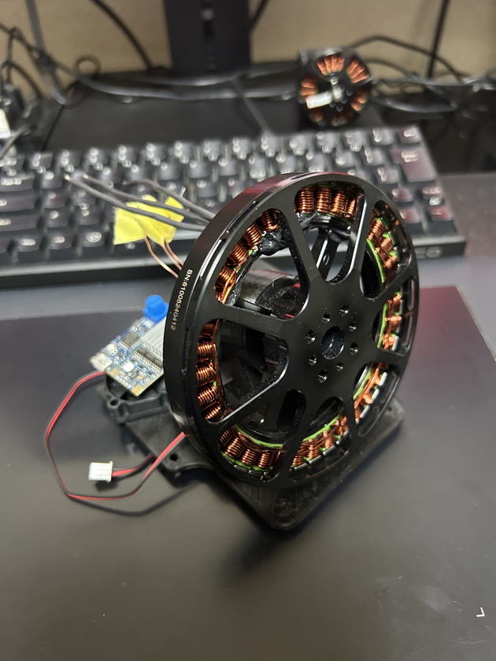
  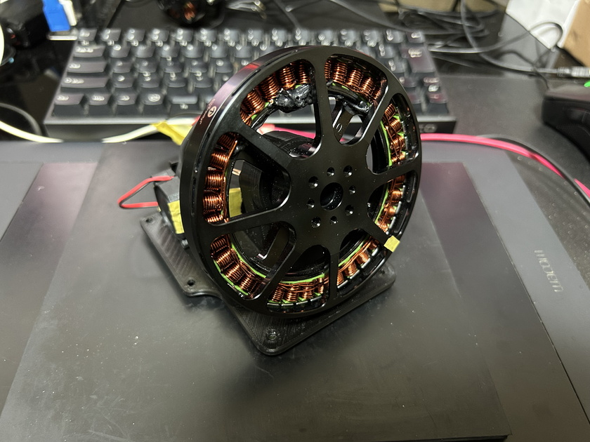
  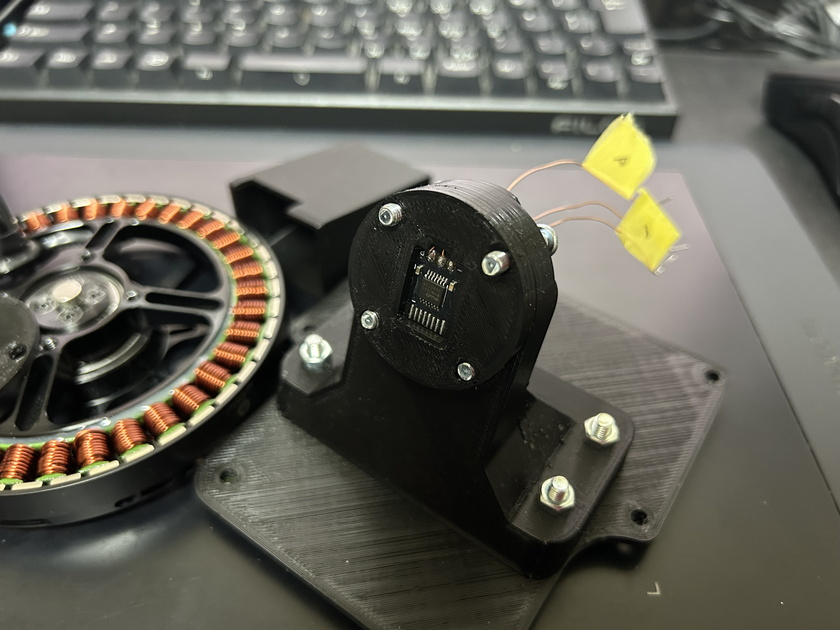
  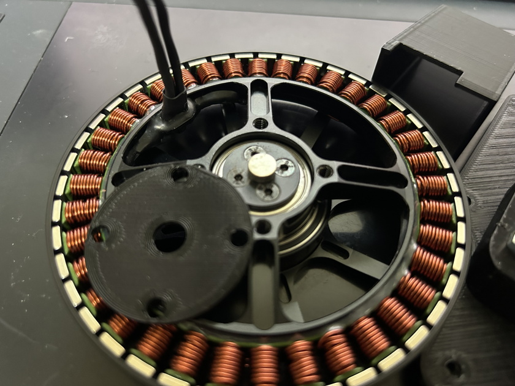
  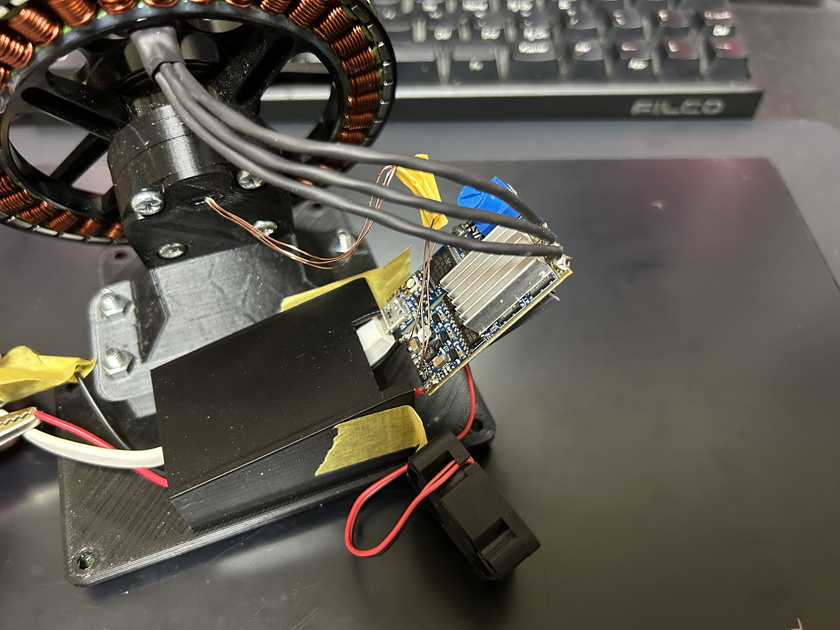
</p>

### Arduino Setup

* Install the Arduino board support package for the STM32.
  * https://github.com/stm32duino/Arduino_Core_STM32
* Install the SimpleFOC library.
  * https://github.com/simplefoc/Arduino-FOC
* Select the following board in arduino ide.
  * Board
    * STM32 boards groups
      * Discovery
  * Board part number
    * B-G431B-ESC1

### Code Setup

* Enable to include `config.MN1005_tc_vol.hpp` in `controller/config.hpp`

### Upload Program

* Select "Mass Strage" as the upload method on the Aruidno IDE.
* Connect the board to the host PC with a usb cable.
* Click the upload button

## NANO SFOC

> * **NOTICE**
>   * The official support webpage currently seems to be down.
>   * The following contains reverse engineered information.
>   * It seems that there are multiple variations of the board. I'm not sure the following information is applicable to all versions.
>   * Use at your own risk.

<p align=""> 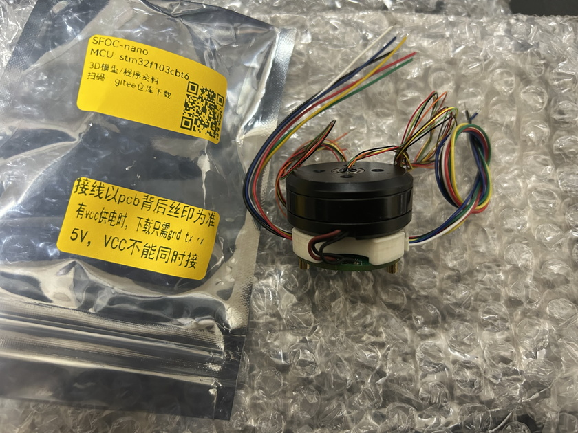 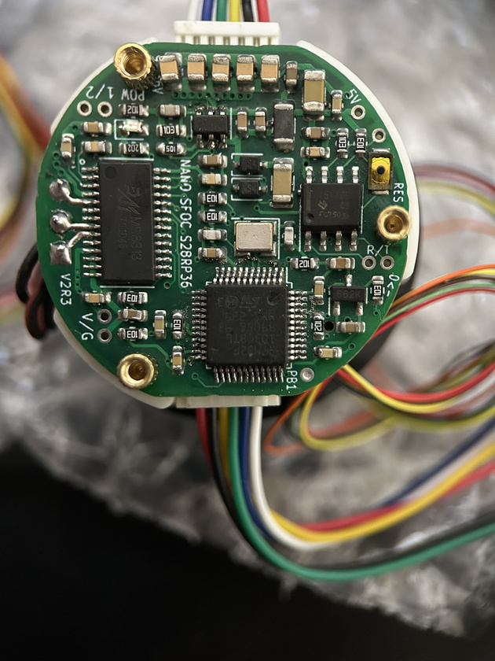 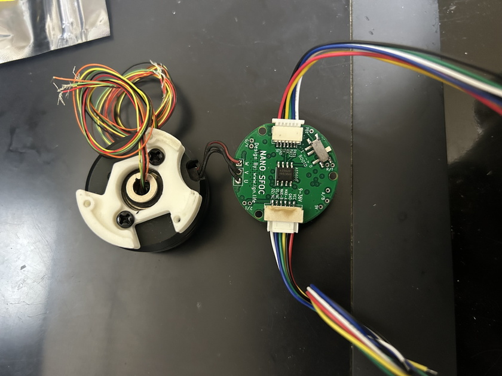 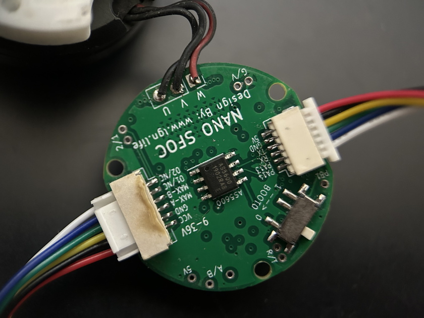 </p>

### Arduino Setup

* Install the Arduino board support package for the STM32.
  * https://github.com/stm32duino/Arduino_Core_STM32
* Install the SimpleFOC library.
  * https://github.com/simplefoc/Arduino-FOC
* Select the following board in arduino ide.
  * Board
    * STM32 boards groups
      * Generic STM32F1 series
  * Board part number
    * Generic F103CBTx

### Code Setup

* Enable to include `config.NanoSFOCvX_tc_vol.hpp` in `controller/config.hpp`

### Upload Program

* Install STM32CubeProgrammer
  * https://www.st.com/ja/development-tools/stm32cubeprog.html
* Select "STM32CubeProgrammer (Serial)" as the upload method on the Aruidno IDE.
* Set the BOOT0 slide switch to the “1” side.
  * When power is turned on with BOOT0 set to “1”, the MCU boots from internal boot ROM.
* Use a USB-UART converter to connect to the host PC.
* Turn on the power.
  * Apply 5V or VCC (about 12V).
* Click the upload button

### Miscellaneous

<p align=""> 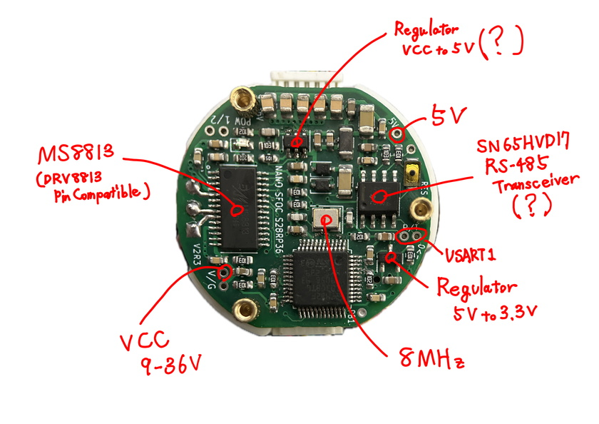 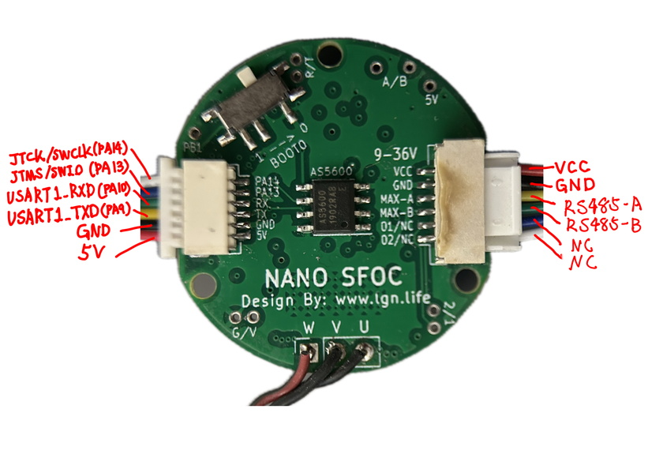 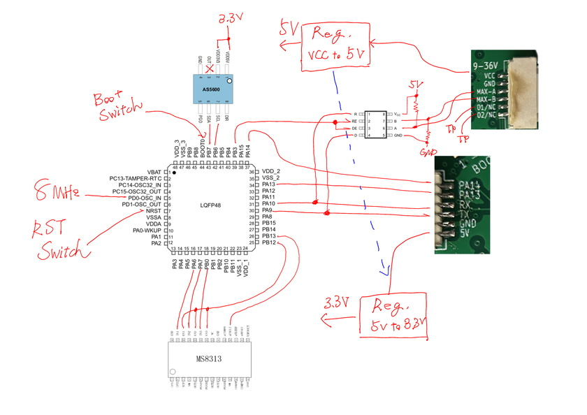 </p>

# SimpleFOC Command Cheet Sheet

```
// disable
ME0
// enable
ME1

// torque
MC0
// velocity
MC1
// angle
MC2
// vel_open
MC3
//angle_open
MC4

// T - Torque control type
// 0 - voltage
MT0
// 1 - dc_current
MT1
// 2 - foc_current
MT2

// e.g.
//   Get value : MVP
//   Set value : MVP0.1

// vel pid
MVP
MVI
MVD
MVL
MVR
MVF
// angle pid
MAP
MAI
MAD
MAL
MAR
MAF
// q curr pid
MQP
MQI
MQD
MQL
MQR
MQF
// d curr pid
MDP
MDI
MDD
MDL
MDR
MDF

// Limits
//  Current
MLC
//  Voltage
MLU
//  Velocity
MLV
```

controller/controller.ino custom commands.

```
// Set Motion Target
T1
T0.1

// Encoder Monitor
//  disable
E-1
//  enable (interval = 10 ms)
E10

// SimpleFOC Monitor
//  disable
S0
//  enable
S1

// Run Demo Motions
//  enable
D1
//  disable
D0

// Software Reset
R
```
